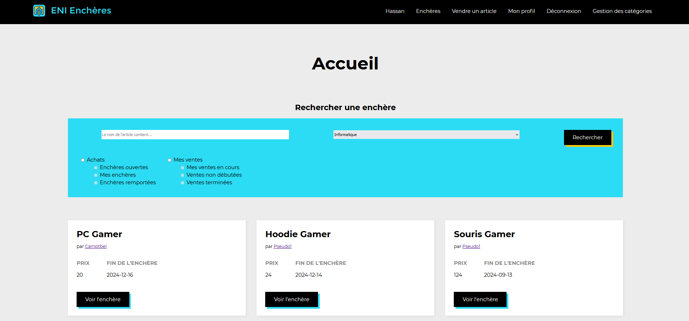

# Projet grp7 - enchère

L’association « Les objets sont nos amis » désire monter une plateforme web pour permettre
la cession d’objets de seconde main sans échanges financiers. La valeur des articles sera
déterminée par un système d’enchères basée sur un nombre de points. Les points sont
gagnés en vendant des objets, puis peuvent être utilisés pour acquérir d’autres objets.

## Table des matières

<!-- TOC -->
* [Projet grp7 - enchère](#projet-grp7---enchère)
  * [Table des matières](#table-des-matières)
  * [Aperçu](#aperçu)
  * [Technologies utilisées](#technologies-utilisées)
  * [Installation](#installation)
  * [Utilisation](#utilisation)
    * [Comptes administrateurs](#comptes-administrateurs)
    * [Comptes utilisateurs](#comptes-utilisateurs)
  * [Auteur](#auteur)
<!-- TOC -->

## Aperçu



## Technologies utilisées

Liste des technologies principales utilisées dans le projet :

- Spring boot
- Thymeleaf
- MySQL

Liste des principaux languages utilisées dans le projet :

- Java
- HTML
- CSS
- JavaScript

## Installation

```bash
git clone git@github.com:newennT/projet-encheres.git
cd projet-encheres
```

**Pas besoin d'initialiser une quelconque base de données, une base de données est hébergée pour le projet.**

## Utilisation

Une fois le projet cloné, vous pouvez directement le lancer depuis la classe
```bash
ProjectGrp7EnchereApplication
```

Plusieurs utilisateurs tests sont présents dans la base de données afin de pouvoir tester l'application

### Comptes administrateurs

> **Pseudonyme:** Camptbel - **Mot de passe:** sonw8gjy&4neC6L


### Comptes utilisateurs

> **Pseudonyme:** Pseudo1 - **Mot de passe:** Mdp?1111

> **Pseudonyme:** Ougi - **Mot de passe:** sonw8gjy&4neC6L

## Auteur

- **Celine GOUYET** - D2WM
- **Adrien CAMINADE** - CDA
- **Newenn TURBIAU** - D2WM
- **Hassan PACARY** - CDA